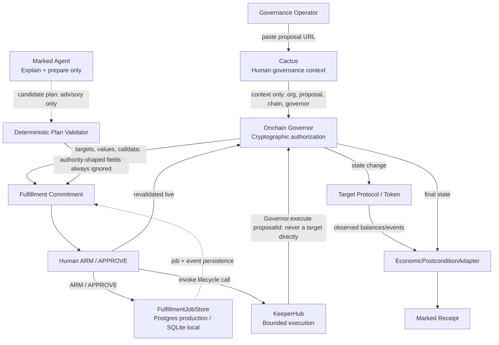
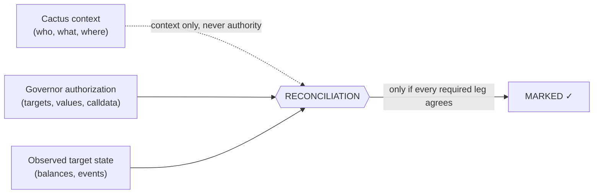
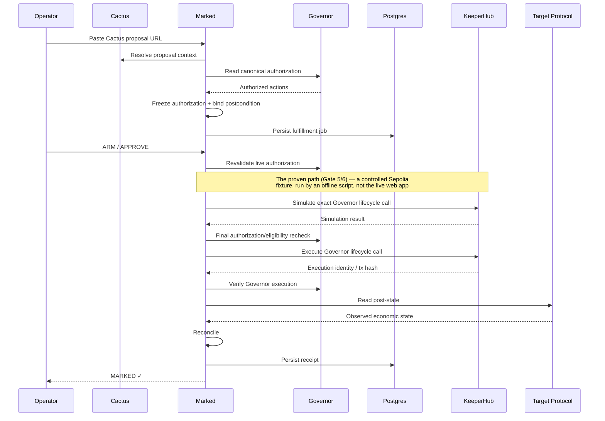
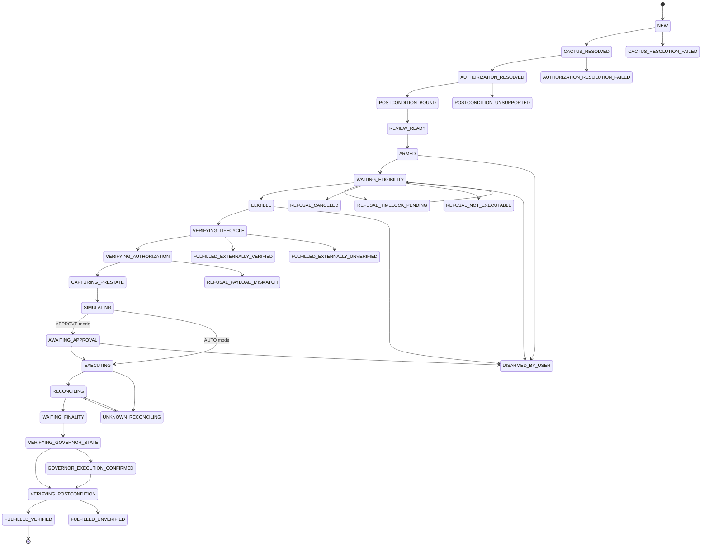
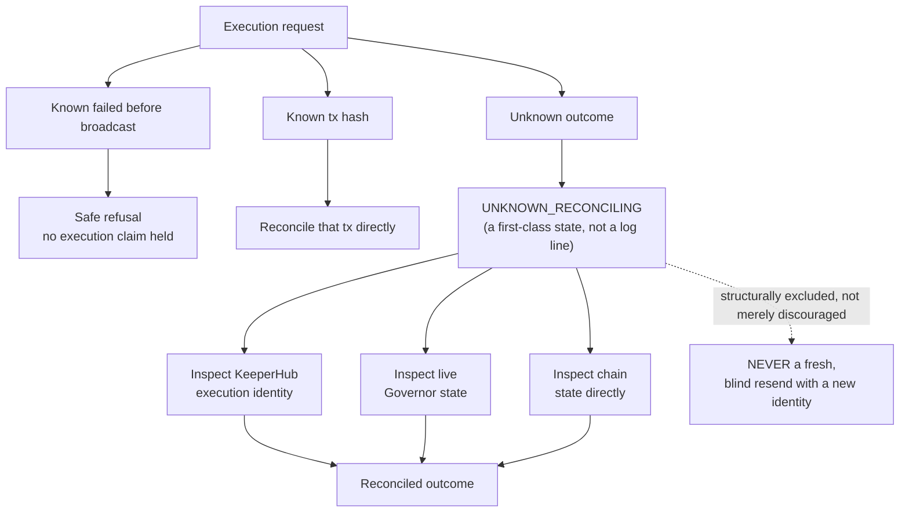
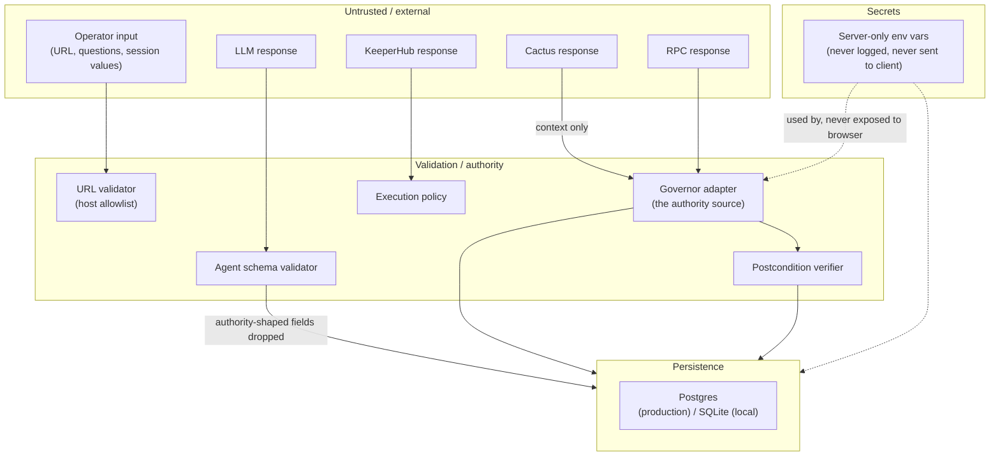

# Marked

Governance is not finished when it passes.
It is finished when it is Marked.

A DAO can pass a proposal and still require someone to return later, wait for the timelock, execute the authorized action, and verify that the intended economic result actually happened. Between "passed" and "done," there is a gap — sometimes minutes, sometimes days — where a legally authorized action simply sits, unexecuted or unverified. **Marked closes that fulfillment gap.**

**Deterministic governance fulfillment for Cactus-indexed DAOs, executed by KeeperHub, verified by Marked.**

This README is the canonical technical entry point for this repository — it maps the whole system, links to deeper documentation, and states plainly what has and has not been proven. **It describes the repository as it stands after Gate 12's hostile security audit**, not as originally proposed. Where a claim below sounds weaker than you'd expect, that is deliberate — see [Security Model](#security-model) and [Mode C / Current Limitations](#mode-c--current-limitations).

One honesty note up front, since it governs every sentence below: **Marked has not executed a live, Cactus-indexed DAO proposal through KeeperHub.** What it *has* proven, independently: (a) real live resolution of real mainnet Cactus proposals, read-only, and (b) a real KeeperHub-mediated execution and independent economic verification, on a controlled Sepolia Governor. These are two separate, labeled pieces of evidence — never narrated as one continuous closed loop. See [Mode C](#mode-c--current-limitations).

---

## Table of contents

[The problem](#the-problem) · [What Marked does](#what-marked-does) · [System architecture](#system-architecture) · [The three truths](#the-three-truths) · [Cactus integration](#cactus-integration) · [Governor authorization engine](#governor-authorization-engine) · [Fulfillment commitment](#fulfillment-commitment) · [Agent boundary](#agent-boundary) · [KeeperHub execution](#keeperhub-execution) · [Execution sequence](#execution-sequence) · [State machine](#state-machine) · [Failure and recovery model](#failure-and-recovery-model) · [Economic postcondition verification](#economic-postcondition-verification) · [Marked Receipt](#marked-receipt) · [Persistence architecture](#persistence-architecture) · [Security model](#security-model) · [Trust boundaries](#trust-boundaries) · [Repository structure](#repository-structure) · [Web routes](#web-routes) · [Environment variables](#environment-variables) · [Local development](#local-development) · [Database development](#database-development) · [Testing strategy](#testing-strategy) · [Evidence / reproducibility](#evidence--reproducibility) · [Canonical proof](#canonical-proof) · [Mode C / current limitations](#mode-c--current-limitations) · [Decision records](#decision-records) · [Development laws](#development-laws) · [Documentation index](#documentation-index) · [Deployment](#deployment) · [FAQ](#faq) · [License](#license)

---

## The problem

**PASSED ≠ EXECUTED ≠ ECONOMICALLY FULFILLED.**

A governance vote passing is a political fact. Whether the authorized action was then actually executed, and whether execution produced the intended economic effect, are separate, later facts — and nothing in most DAO tooling proves either one.

Across 353 executed Governor Bravo proposals on Compound and Uniswap (Ethereum mainnet), the reproduced interval from execution-eligible (Timelock `eta`) to actually-executed has a **median of 2.2 minutes**, a **P90 of 12.96 hours**, a **P95 of 38.03 hours**, and a **max of 231.14 hours** (Uniswap #20).

This measures **execution timing only**. It does **not** prove why any specific delay occurred, and it does **not** claim Marked would have executed any of these proposals faster had it existed at the time — this is a historical timing measurement, not a counterfactual about Marked's own performance. See [`evidence/historical/`](evidence/historical/) and `DEC-025`.

## What Marked does

1. Start from an existing Cactus proposal.
2. Resolve its governance coordinates (organization, chain, Governor).
3. Independently read the Governor contract on-chain.
4. Reconstruct exactly what governance authorized (targets, values, calldata).
5. Freeze that authorization into a versioned hash.
6. Bind supported economic postconditions to the authorized actions.
7. A human reviews and arms fulfillment.
8. Marked waits until execution is legally eligible (timelock, etc.).
9. Marked revalidates everything live, immediately before acting.
10. KeeperHub invokes the Governor's own lifecycle call.
11. Marked waits for finality.
12. Marked independently reads the resulting target-protocol state.
13. Only if authorization, execution, and observed outcome all agree does the fulfillment become `MARKED ✓`.

**Marked does not vote. Marked does not create proposals. Marked does not decide what should happen. The agent does not control funds. KeeperHub does not reinterpret governance.**

## System architecture



Notice what is **absent**: no arrow from Cactus or the Agent to KeeperHub. Neither can construct or authorize an execution. Full depth: [`docs/ARCHITECTURE.md`](docs/ARCHITECTURE.md).

## The three truths

**Truth 1 — human/political context (Cactus).** Which DAO, which proposal, what humans were discussing. Never money-moving.

**Truth 2 — cryptographic authorization (the Governor).** Targets, values, signatures, calldata, proposal identity, read directly from the contract. This is execution authority.

**Truth 3 — economic reality (the target protocol).** What actually changed on-chain — independently observed, never inferred from a transaction succeeding.



**`MARKED ✓` exists only when authorization, execution, and observed economic outcome agree.** No single leg — a KeeperHub "completed" status, a transaction receipt's `status: 1`, `Governor.state() == Executed` alone, or a `Transfer` event's mere existence — can produce it alone; `reconcileForMarkedReceipt`'s own input type structurally excludes every one of those shortcuts. See `packages/core/src/receipt.ts`.

## Cactus integration

```text
Cactus proposal URL
        ↓  strict URL validation (https-only, exact-hostname allowlist)
        ↓  official GraphQL path, if an authenticated key exists
        ↓  otherwise: real public Cactus/Tally proposal-page resolution
        ↓  server-rendered structured data (the same data the real Cactus frontend renders)
        ↓  organization / proposal / chain / Governor coordinates
        ↓  independent Governor reads (on-chain, never from Cactus)
```

**The SSR fallback path is not simulated Cactus.** It is a real HTTP request to the live public Cactus/Tally proposal page on every resolution — not a mock, not fixture data. It is, however, **not** the officially-authenticated GraphQL path — that path was not the default during this project's build because no authenticated `CACTUS_API_KEY` was available in this environment (no zero-auth read path exists for Cactus's official API). Never imply the authenticated path is what's actually running by default; it isn't.

Cactus never supplies calldata, actions, or an authorization hash. Marked always re-derives those directly from the Governor, independently, before anything can be armed.

**Marked does not create a proposal on Cactus.** Operator prerequisite: (1) the DAO already has governance indexed on Cactus, (2) an open or historical proposal exists, (3) copy that proposal's page URL, (4) paste it into Marked's `/app/new`.

**Current limitation**: self-service DAO registration on Cactus was observed paused during this project's build — there is no "Create DAO"/"Create Proposal" integration, and none is claimed. See [Mode C](#mode-c--current-limitations).

## Governor authorization engine

Governor Bravo only. A canonical authorization is:

```
chainId · Governor address · governorFamily · proposalId
· ordered actions: [{ target, value, signature, calldata }, ...]
```

Canonical Gate 2 hash: `0x29fab99c1fd3e796981fb2ae34b92280c7405bfafe6ef60882628ddec1dab28d`.

Deliberately **excluded** from this hash: ETA, queued state, current lifecycle state, execution timestamp — these are temporal facts about a proposal, not part of what it authorizes. A proposal's lifecycle transitioning must never change its authorization hash — proven with a dedicated test resolving the same proposal at two different lifecycle states.

**Frozen vs. current**: a commitment freezes the authorization hash at review time. Before ARM, Marked re-reads the Governor live and compares — any drift refuses, it never silently re-arms against a new value. Full depth: [`docs/ARCHITECTURE.md` §9](docs/ARCHITECTURE.md#9-governor-authorization).

## Fulfillment commitment

```
Governor authorization
       ↓
postcondition binding
       ↓
execution policy
       ↓
Fulfillment Commitment
       ↓
human approval
```

`FulfillmentCommitment` binds: chain, Governor, proposal, frozen authorization hash, selected action indexes, postcondition bindings, fulfillment mode, execution surface id, execution policy version. **Why it exists**: the object a human approved must be the exact same object later considered for execution — approval binds to this commitment's exact hash, never to "whatever is current." Full depth: [`docs/ARCHITECTURE.md` §11](docs/ARCHITECTURE.md#11-fulfillment-commitment).

## Agent boundary

```
ResolvedGovernanceContext + CanonicalGovernorAuthorization
+ DeterministicPostconditionSupport + FulfillabilityAssessment
   (already independently resolved, before the model is ever called)
                    ↓
LLM produces:       CandidateAgentPlan
                    (explanation, summary, suggested action indexes,
                     risk notes — a .strict() schema with NO field for
                     any authority-bearing value)
                    ↓
Deterministic validator: ValidatedAgentPlan  |  AGENT_PLAN_REJECTED
```

**The agent cannot author**: recipient, amount, target, calldata, Governor, proposalId, chainId, any authorization hash, execution function, approval, or verified state — not because a filter strips these after the fact, but because the schema has no field for them at all. **The model is advisory. The validator is authoritative.**

A real, live OpenRouter model was exercised through this exact boundary during development (`evidence/agent-hardening/live-model/`) — that is a **recorded proof**, not the default behavior of a fresh clone, which ships with no model-provider key and shows an honest "Agent unavailable" state until an operator configures one. Full depth: [`docs/ARCHITECTURE.md` §14](docs/ARCHITECTURE.md#14-agent-boundary).

## KeeperHub execution

Marked's v1 execution surface is KeeperHub's direct execution endpoint (Option B), not Workflow-based execution (Option A) — see `DEC-019` for why.

`simulateContractCall()` and `executeContractCall()` are two **structurally separate** functions — never one ambiguous `execute(call, { simulate: maybe })` path. `executeContractCall` sends a deterministic `Idempotency-Key` derived from the call itself.

**KeeperHub always calls the Governor's own lifecycle entrypoint** (e.g. Bravo's `execute(proposalId)`) — **never a target contract directly**, no matter how confident Marked is about what that call would do.

**Important, and load-bearing for how to read every security claim in this document**: the deployed web app's code has no path to `executeContractCall` at all — repo-wide grep confirms it. The controlled Sepolia execution this project proved was run by a developer invoking an offline script directly, never by the live app. See [Security Model](#security-model).

## Execution sequence



This diagram shows the full, proven pipeline end to end — the part below "ARM / APPROVE" is proven via the offline Gate 5/6 proof script against a controlled Sepolia fixture, not (yet) wired into the deployed web app's live request path. See [Mode C](#mode-c--current-limitations).

## State machine



(Refusal/blocked terminal states — `REFUSAL_SIMULATION_REVERT`, `BLOCKED_INSUFFICIENT_GAS`, `REFUSAL_WORKFLOW_POLICY_VIOLATION`, `BLOCKED_CALLER_NOT_AUTHORIZED`, `DUPLICATE_SUPPRESSED` — omitted from the diagram above for readability; each is a real, named edge out of `SIMULATING`/`EXECUTING`. Full transition table, every edge, source of truth: `packages/core/src/fulfillment-state-machine.ts`.)

**`MARKED ✓` is the display label for `status === "FULFILLED_VERIFIED"`, computed by exactly one function.** No UI surface invents its own partial-status check. A full breadth-first reachability test (added Gate 12) confirms every declared status is actually reachable from `NEW` — no orphan states. Full depth: [`docs/ARCHITECTURE.md` §12](docs/ARCHITECTURE.md#12-state-machine).

## Failure and recovery model

The dangerous ambiguity this design exists to close:

```
EXECUTION REQUEST
      |
      +-- known failed before broadcast → safe refusal
      |
      +-- known tx hash → reconcile that tx directly
      |
      +-- unknown outcome → RECONCILING
                              |
                              +→ inspect KeeperHub execution identity
                              +→ inspect live Governor state
                              +→ inspect chain state directly
                              |
                              +→ NEVER a fresh, blind resend with a new identity
```



If a request is sent, the provider may broadcast, and the connection dies before Marked learns the outcome, **Marked must not simply send again** — a second broadcast could double-execute. The recovery classifier's own return type structurally excludes resubmission as an outcome (`mayResubmit` is typed as the literal `false`, not `boolean`) — a future code change cannot accidentally permit it by flipping a runtime flag. `UNKNOWN_RECONCILING` is a first-class state, not a log line. **Honestly**: this path is not yet live-exercised against real infrastructure, and no application code in the deployed app currently drives a job through it, because the deployed app does not currently trigger real execution at all. Full depth, including what is and isn't proven here: [`docs/ARCHITECTURE.md` §21](docs/ARCHITECTURE.md#21-unknown-outcome-recovery), [`docs/SECURITY.md`](docs/SECURITY.md).

## Economic postcondition verification

A transaction succeeding is not sufficient — `receipt.status == 1` proves the call didn't revert, not that the authorized economic effect occurred. `EconomicPostconditionAdapter`'s current implementation, `ERC20TransferAdapter`, decodes expected token/recipient/amount **only from the authoritative Governor action bytes**, never from proposal prose. Verification requires all four: a block-pinned pre-balance, a block-pinned post-balance, an exact delta, and a transaction-bound `Transfer` log.

**Fails closed, never approximated**: fee-on-transfer tokens, rebasing tokens, ambiguous/duplicate matching logs, wrong token/recipient/amount, unsupported action semantics (`transferFrom`, unrecognized signatures) all produce `verified: false` or an outright refusal to support — never a "close enough" pass.

Coverage is `FULL` / `PARTIAL` / `UNSUPPORTED`; `MARKED ✓` requires every required material action to have `FULL` coverage.

## Marked Receipt

```json
{
  "version": 1,
  "fulfillmentCommitmentHash": "0x011a295825915fb42918db175e04153f9714acacde8794ece7fda484443441a4",
  "frozenActionAuthorizationHash": "0x2fe3f808910a5d89ff9d233d34ecd53fe66d89d3ce46e340891599e784167a3b",
  "finalGovernorAuthorizationHash": "0x2fe3f808910a5d89ff9d233d34ecd53fe66d89d3ce46e340891599e784167a3b",
  "chainId": 11155111,
  "governor": "0xe86cdc53f3c4f416be42f13f621be96ab9d30727",
  "governorFamily": "GOVERNOR_BRAVO",
  "proposalId": "2",
  "actionIndex": 0,
  "executionTxHash": "0x49ac3ebbd7e957cb8b57e0e1dcc0e2e24243b2ae72c34cc1b839c7fe8a81d7cb",
  "executionBlock": "11716393",
  "finalityBlock": "11716395",
  "governorFinalState": 7,
  "postconditionCoverage": "FULL",
  "requiredAssertionsVerified": true,
  "status": "FULFILLED_VERIFIED",
  "receiptHash": "0x332ea2320ba4a0af131cfbfd78bfd55418b2eca6746df3d722c9eed2c77219c4"
}
```

**`receiptHash` is not a blockchain transaction hash** — `executionTxHash` is the separate field for that; view it on [Sepolia Etherscan](https://sepolia.etherscan.io/tx/0x49ac3ebbd7e957cb8b57e0e1dcc0e2e24243b2ae72c34cc1b839c7fe8a81d7cb). `receiptHash` is a domain-separated hash over the whole structure above, independently recomputable by anyone: `pnpm verify:gate6`. A pre-existing, dedicated mutation-sensitivity test suite (`packages/core/src/receipt.test.ts`) proves the hash changes under a mutation to any load-bearing field.

## Persistence architecture

```
FulfillmentJobStore                (the interface — business logic depends
      ├── SqliteFulfillmentJobStore     on this, never a concrete class)
      │      local development/testing (default)
      ├── PostgresFulfillmentJobStore
      │      production-compatible, Vercel-safe
      └── InMemoryFulfillmentJobStore
             fastest unit-test double
```

Driver selection is explicit (`MARKED_STORAGE_DRIVER`), never inferred from `NODE_ENV`, and **fails closed** — a misconfigured or unrecognized value throws `PersistenceConfigurationError` rather than silently falling back to SQLite. A malformed `DATABASE_URL` also fails closed as a typed error (fixed Gate 12 — previously a raw driver exception).

**Both backends are proven, not merely implemented, against a real database engine.** Atomic compare-and-set (including genuine two-concurrent-worker races), atomic job+event writes, transaction rollback via a genuine forced mid-transaction failure, restart/reconnect durability, and JSONB serialization round-trip have all been exercised for real against a **real hosted Neon Postgres database** (Gate 11) — not simulated, not skipped. See [`evidence/production-persistence/hosted-production-proof.md`](evidence/production-persistence/hosted-production-proof.md).

**Test-database safety (Gate 12)**: the hosted-Postgres test suite runs destructive operations. Running it now requires an explicit, second `MARKED_ALLOW_DESTRUCTIVE_DB_TESTS=true` opt-in in addition to `DATABASE_URL` — `pnpm test` can no longer wipe a real database merely because one happens to be reachable. See [`docs/TESTING.md`](docs/TESTING.md).

## Security model

Full document: [`docs/SECURITY.md`](docs/SECURITY.md) — fed directly by the [Gate 12 hostile audit](evidence/system-audit/), not marketing copy. Summary:

- **Authority separation**: Cactus identifies, the Governor authorizes, the agent only advises (structurally — the schema has no authority field), KeeperHub only fulfills an already-frozen authorization.
- **Commitment revalidation**: every ARM re-reads the Governor live and compares against the frozen hash; approval binds to the exact commitment hash, never "whatever is current."
- **Caller-authority check, simulation-before-execution, idempotency key**: all real, all in `packages/keeperhub` — but currently unreachable from the deployed app (see [KeeperHub execution](#keeperhub-execution)).
- **Compare-and-set concurrency**: ARM/APPROVE/DISARM and the execution-claim layer both use a real atomic guard — a genuine race (two concurrent requests from the same read snapshot both silently "succeeding") was found and fixed in Gate 12.
- **Unknown-outcome reconciliation, economic postcondition, finality**: see the sections above.
- **SSRF controls**: a strict host allowlist on the one user-controlled URL in the app; one known, documented gap (redirect-destination re-validation) — see `docs/SECURITY.md`.
- **Production DB test isolation**: see [Persistence architecture](#persistence-architecture) above.
- **Secret handling**: no real secret has ever been found in this repository's tracked tree or git history, at any gate, including this one.

**Authentication — corrected claim, read this before trusting an older statement anywhere else**: ARM/APPROVE/DISARM always authenticate before any mutation, and the raw-header auth path genuinely requires knowing the real session secret (now constant-time compared). **However, the cookie/UI login path ("Enter demo workspace") does not require the visitor to know that secret at all** — it is a name-only form by deliberate design (a judge should never need the real token), and any visitor who reaches `/app` can self-issue a session and mutate any job by id. This is disclosed, not hidden, and — because the deployed app has no path to a real blockchain write at all (see [KeeperHub execution](#keeperhub-execution)) — it cannot produce an unauthorized on-chain effect. It is a real, open product-design question, not a silently-accepted bug. See `docs/SECURITY.md` §Authentication and `evidence/system-audit/findings.md` finding F-03.

## Trust boundaries



Full boundary-by-boundary table (source, trust level, validation, failure mode, timeout, secret risk): [`evidence/system-audit/trust-boundaries.md`](evidence/system-audit/trust-boundaries.md).

## Repository structure

| Package | Purpose | Authority | Must never |
|---|---|---|---|
| `apps/web` | The deployed Next.js App Router product | Orchestrates every package below; owns the session boundary | Construct a blockchain write anywhere in its own code (grep-confirmed it doesn't) |
| `apps/cli` | `marked verify <receipt_id>` and other operator commands | Read-only verification tooling | — |
| `packages/core` | State machine, job/event types, auth, receipt computation, agent-plan validation, fulfillability, recovery | Owns the transition table and the receipt-reconciliation invariant | Perform network I/O; accept a status transition outside its own table |
| `packages/config` | A strict, fail-closed env schema | None — not wired into any runtime path (dead code by design, disclosed) | Be assumed to actually validate production env vars — it doesn't run there |
| `packages/cactus` | Resolve governance-native context from a proposal URL | None over execution calldata | Supply `actionAuthorizationHash` or any money-moving action data |
| `packages/governor` | Read a Governor's canonical authorized actions and lifecycle state | The execution authorization source | Accept a cached/indexed value in place of a live contract read for an authorization decision |
| `packages/keeperhub` | Simulate/execute a Governor lifecycle call via KeeperHub | Fulfill an already-authorized call | Reinterpret governance intent; call a target contract directly; merge simulate/execute into one ambiguous call |
| `packages/postconditions` | Verify a target protocol's resulting economic state | Independent economic observer | Approximate an unsupported semantic as verified; read Cactus-rendered prose |
| `packages/db` | `FulfillmentJobStore` abstraction + implementations, migrations | Persistence only | Silently fall back between backends; run destructive test operations without explicit opt-in |
| `scripts/` | One-time, offline proof/verification scripts | The only place a real blockchain write is possible in this repository | Be reachable from `apps/web`'s request-handling code (confirmed not reachable) |
| `evidence/` | Committed, reproducible proof artifacts | The record of what's actually been demonstrated | Contain a real secret (verified before every commit, every gate) |

Full per-package depth: [`docs/ARCHITECTURE.md` §7](docs/ARCHITECTURE.md#7-package-boundaries).

## Web routes

| Route | Purpose | Access | Read/write | External side effects |
|---|---|---|---|---|
| `/` | Landing — problem, mechanism, three truths, proof, FAQ | Public | Read | None |
| `/demo` | Guided replay of the real Gate 5/6 KeeperHub fulfillment | Public | Read | None |
| `/evidence` | Technical proof matrix, PROVEN/TARGET/BLOCKED/REJECTED | Public | Read | None |
| `/docs`, `/docs/[slug]` | In-app product & developer documentation (distinct from this repo's `docs/` directory) | Public | Read | None |
| `/proof/[id]` | Public, read-only Marked Receipt (`id="gate6"` is the canonical proof) | Public | Read | Agent Q&A available (rate-limited, Gate 12) |
| `/app` | Fulfillment dashboard | Session-gated (see [Security Model](#security-model)) | Read (lists all jobs) | None |
| `/app/new` | Cactus proposal intake | Session-gated | Read + write (resolves and creates a job) | Live Cactus + Governor RPC calls |
| `/app/fulfillments/[id]` | Review / arm / approve / disarm a job | Session-gated | Read + write | Live Governor RPC call on ARM |
| `GET /api/fulfillment/state?jobId=` | Programmatic job read | **Public, intentionally unauthenticated** | Read | None |
| `POST /api/fulfillment/{arm,disarm,approve}` | Programmatic mutation | Session-gated | Write | Live Governor RPC call on arm |

## Environment variables

Full audited matrix, generated from actual source usage: [`VERCEL_ENVIRONMENT.md`](VERCEL_ENVIRONMENT.md). Quick-start only below — **no real values shown**.

| Variable | Purpose | Required (local) | Required (production) | Secret? |
|---|---|---|---|---|
| `MARKED_DEMO_SESSION_TOKEN` | Gates ARM/APPROVE/DISARM | Yes, for the mutating flow | Yes | Yes |
| `MARKED_STORAGE_DRIVER` | `sqlite` (default) or `postgres` | No | Yes (`postgres`) | No |
| `DATABASE_URL` | Postgres connection string | Only if `MARKED_STORAGE_DRIVER=postgres` locally | Yes | Yes |
| `MARKED_ALLOW_DESTRUCTIVE_DB_TESTS` | Second opt-in for the live-Postgres test suite (Gate 12) | Only when running that suite | No | No |
| `CACTUS_API_KEY` | Official authenticated Cactus GraphQL path | No — public SSR resolution works without it | No | Yes |
| `OPENROUTER_API_KEY` / `ANTHROPIC_API_KEY` | Agent panel | No — agent shows "unavailable" without it | No | Yes |
| `KEEPERHUB_API_KEY` | Only consumed by offline proof scripts | No (unless running those scripts) | No — never read by the deployed app | Yes |

There is no separate `TEST_DATABASE_URL` — `DATABASE_URL` itself is what the guarded live-Postgres tests read, gated by `MARKED_ALLOW_DESTRUCTIVE_DB_TESTS`. See [`docs/TESTING.md`](docs/TESTING.md).

## Local development

```bash
git clone https://github.com/TheWeirdDee/marked.git
cd marked
pnpm install
cp apps/web/.env.example apps/web/.env.local   # fill in MARKED_DEMO_SESSION_TOKEN at minimum
pnpm dev             # start the web app — visit /demo for the guided journey
```

```bash
pnpm typecheck   # tsc --noEmit, all packages — no network, no DB
pnpm lint        # eslint + next lint — no network, no DB
pnpm test        # vitest, all packages — no network, no DB, no destructive operation by default
pnpm build       # production build — no DB connection, no migration, no network write
```

**None of the above can accidentally trigger a blockchain write or a destructive database operation.** See [`docs/TESTING.md`](docs/TESTING.md) for the exact per-command dependency table (which commands need network/DB/an LLM key/a KeeperHub key), and for the one thing you must never do: set `MARKED_ALLOW_DESTRUCTIVE_DB_TESTS=true` against any database that isn't disposable.

## Database development

- **SQLite** (default, `MARKED_STORAGE_DRIVER` unset): a local file under `apps/web/.data/`, created lazily on first use. No setup needed.
- **Postgres** (production-compatible): set `MARKED_STORAGE_DRIVER=postgres` and `DATABASE_URL`, then `pnpm db:migrate` once.
- **Migration command**: `DATABASE_URL=<value> pnpm db:migrate` — additive-only, safe to re-run, never automatic.
- **Hosted integration test command**: `DATABASE_URL=<disposable database> MARKED_ALLOW_DESTRUCTIVE_DB_TESTS=true pnpm --filter @marked/db test` — **both** variables are required; the guard refuses to even connect without the second one. Never run this against a database holding real data.

Full depth: [`docs/OPERATIONS.md`](docs/OPERATIONS.md), [`docs/TESTING.md`](docs/TESTING.md).

## Testing strategy

Unit, property/invariant (a full state-machine reachability walk), contract (SQLite and Postgres proven interchangeable via one shared suite), integration, hosted-Postgres, adversarial-agent, historical-reproduction, canonical-receipt-verification, and security tests. **`pnpm test` performs zero blockchain writes**, always. The only two scripts in the whole repository capable of a real blockchain write (`scripts/gate5-deploy-and-queue.ts`, `scripts/gate5-keeperhub-execute.ts`) have no `pnpm` script alias at all — running them requires explicitly invoking `tsx` on the file by path. Full taxonomy and the complete per-command external-dependency table: [`docs/TESTING.md`](docs/TESTING.md).

## Evidence / reproducibility

Every claim below maps to a committed artifact and a reproduction command — this is the actual discipline this project holds itself to, not aspirational.

| Claim | Status | Evidence | Reproduce |
|---|---|---|---|
| Cactus resolution (live, public) | PROVEN | `evidence/cactus/` | Visit `/app/new`, paste a real Tally URL |
| Governor authorization reconstruction | PROVEN | `evidence/governor/` | `pnpm prove:governor` |
| KeeperHub execution (controlled Sepolia) | PROVEN | `evidence/lifecycle-fulfillment/` | `tsx scripts/gate5-keeperhub-execute.ts` (requires deployer credentials) |
| ERC20 postcondition verification | PROVEN | `evidence/postconditions/` | `pnpm prove:erc20-postcondition` |
| `MARKED ✓` (the one controlled fixture) | PROVEN | `evidence/marked-receipt/` | `pnpm verify:gate6` |
| Historical baseline (353 proposals) | PROVEN | `evidence/historical/` | `pnpm verify:historical` |
| Agent hardening (adversarial validator) | PROVEN | `evidence/agent-hardening/` | `pnpm prove:agent-hardening` |
| Real live LLM proof | PROVEN (recorded) | `evidence/agent-hardening/live-model/` | `pnpm prove:agent-live-model` (needs `OPENROUTER_API_KEY`) |
| Hosted Postgres persistence | PROVEN | `evidence/production-persistence/hosted-production-proof.md` | See `docs/TESTING.md` |
| Gate 12 hostile audit | PROVEN (11 findings, 8 fixed, 3 documented) | `evidence/system-audit/` | See `evidence/system-audit/gate12-result.md` |

## Canonical proof

The one real, controlled Sepolia proof this repository's `MARKED ✓` is built on:

| Field | Value |
|---|---|
| Governor | `0xe86cdc53f3c4f416be42f13f621be96ab9d30727` (Sepolia) |
| Proposal ID | `2` |
| Action authorization hash | `0x2fe3f808910a5d89ff9d233d34ecd53fe66d89d3ce46e340891599e784167a3b` |
| KeeperHub execution tx | [`0x49ac3ebbd7e957cb8b57e0e1dcc0e2e24243b2ae72c34cc1b839c7fe8a81d7cb`](https://sepolia.etherscan.io/tx/0x49ac3ebbd7e957cb8b57e0e1dcc0e2e24243b2ae72c34cc1b839c7fe8a81d7cb) |
| Execution block / finality block | `11716393` / `11716395` |
| Recipient | `0xF02789155998f85D3a0b7dcA1525b059988Ab442` |
| Amount | `1000000000000000000000` raw units |
| `receiptHash` | `0x332ea2320ba4a0af131cfbfd78bfd55418b2eca6746df3d722c9eed2c77219c4` |

This is **controlled Sepolia test infrastructure** — a self-deployed Governor and token, not a real DAO's treasury. The funds moved were test funds between a self-deployed Timelock and a freshly-generated test recipient, never real value. Re-derive it yourself: `pnpm verify:gate6`.

## Mode C / current limitations

**Lane 1** — real Cactus mainnet governance objects, resolved and read-only (Gate 1A). **Lane 2** — a controlled Sepolia Governor, a real KeeperHub write, and real independent economic verification (Gates 5/6). Same Marked engine, two separate, labeled pieces of evidence — **there is no closed-loop Cactus→KeeperHub claim.**

Also true, as of this document:

- Governor Bravo only — no other Governor family is supported.
- No private/MEV-protected routing.
- KeeperHub Workflow-based execution (Option A) is not proven — only direct contract-call execution (Option B) is.
- The demo/hackathon session-auth boundary's cookie/UI path does not require the real secret (see [Security Model](#security-model)) — this is disclosed, not fixed, this gate.
- No real DAO treasury payout has ever occurred through Marked.
- Exactly one controlled `MARKED ✓` fixture exists.
- No model-provider API key ships with a fresh clone — the agent defaults to "unavailable."
- **The deployed web app has no code path to a real blockchain write at all** — every proven KeeperHub execution was run by an offline script, not the live app.
- A `next@15.5.25`-bundled internal `postcss` dependency carries known CVEs (build-time only, not runtime-reachable) — no same-line patch exists yet.
- One SSRF gap: the Cactus SSR-fallback fetch does not re-validate redirect destinations against its host allowlist.

## Decision records

Every material architecture decision or correction lives in [`DECISIONS.md`](DECISIONS.md), append-only. Highlights:

- **`DEC-010`/`DEC-011`/`DEC-026`** — Cactus authority boundary and infrastructure reality.
- **`DEC-015`** — Mode C: the split-proof claim boundary.
- **`DEC-019`** — KeeperHub execution surface locked to Option B.
- **`DEC-021`/`DEC-027`/`DEC-028`** — Persistence architecture, from SQLite-only through a proven hosted-Postgres adapter.
- **`DEC-023`/`DEC-024`** — Agent authority boundary and live-model proof.
- **`DEC-025`** — Historical baseline methodology.

## Development laws

The full, authoritative set is [`BUILD_CONTRACT.md`](BUILD_CONTRACT.md) — 68 gate-derived invariants plus the PRD's original 24 laws. The non-negotiables:

- Cactus context ≠ execution authority.
- The agent's output ≠ execution authority.
- Governor authorization must be frozen before ARM and revalidated immediately before every write.
- KeeperHub must call the Governor's lifecycle entrypoint, never bypass governance by calling a target directly.
- An unknown broadcast outcome must reconcile, never blindly resend with a new identity.
- A successful transaction ≠ economic fulfillment.
- `MARKED ✓` requires independent postcondition verification, not a status string.

## Documentation index

| Document | What it's for |
|---|---|
| [`PRD.md`](PRD.md) | The original product specification |
| [`BUILD_CONTRACT.md`](BUILD_CONTRACT.md) | The non-negotiable laws implementation may never violate |
| [`CLAIMS.md`](CLAIMS.md) | Every public claim, with a PROVEN/TARGET/BLOCKED/REJECTED status and evidence pointer |
| [`GATES.md`](GATES.md) | The full phased build order and pass conditions |
| [`DECISIONS.md`](DECISIONS.md) | Every material architecture decision, append-only |
| [`VERCEL_ENVIRONMENT.md`](VERCEL_ENVIRONMENT.md) | The audited environment-variable matrix |
| [`EXECUTION_SURFACE.md`](EXECUTION_SURFACE.md) | The exact KeeperHub execution surface this project targets |
| [`docs/ARCHITECTURE.md`](docs/ARCHITECTURE.md) | Deep implementation architecture — read this after this README |
| [`docs/SECURITY.md`](docs/SECURITY.md) | The threat/security model, fed by the Gate 12 audit |
| [`docs/OPERATIONS.md`](docs/OPERATIONS.md) | Deployment, migrations, incident rules |
| [`docs/TESTING.md`](docs/TESTING.md) | Test taxonomy, external-dependency table, destructive-test safety |
| [`evidence/`](evidence/) | Every committed proof artifact |
| `/docs` (in the running app) | In-app, judge-facing product documentation — distinct from the `docs/` directory above |

## Deployment

Production storage **must** be Postgres — the default (SQLite) does not survive Vercel's ephemeral, per-instance filesystem. Migrations are explicit (`pnpm db:migrate`), never automatic. Every secret is server-side only. `pnpm build` never opens a database connection (verified every gate). Mainnet writes remain disabled by default (`ENABLE_MAINNET_WRITE=false`) and nothing in this repository silently flips that. Full runbook: [`docs/OPERATIONS.md`](docs/OPERATIONS.md); full env matrix: [`VERCEL_ENVIRONMENT.md`](VERCEL_ENVIRONMENT.md).

## FAQ

**Is Cactus simulated?** No. Every resolution is a real, live HTTP request to real Cactus/Tally infrastructure — either the official authenticated API or the public proposal page, never a mock.

**Do I need a Cactus API key?** No — public resolution works without one. A key enables the officially-authenticated path, which is not this project's current default (no key was available during its build).

**Does Marked create proposals?** No. It only fulfills proposals that already exist and already passed governance.

**Does the AI decide what executes?** No. The candidate-plan schema has no field for any authority-bearing value; a deterministic validator, not the model, decides what's legal.

**Does KeeperHub call the token/protocol directly?** No — always the Governor's own lifecycle entrypoint.

**Does a successful transaction mean `MARKED ✓`?** No. Independent economic-postcondition verification is required in addition.

**Why both Cactus and Governor?** Cactus tells you *which* proposal; the Governor tells you *what it authorizes*. Neither substitutes for the other.

**Why both SQLite and Postgres?** SQLite for fast, zero-setup local development; Postgres because SQLite cannot survive Vercel's serverless filesystem in production. Both are proven against a real database engine, not just one.

**Has Marked executed a real DAO proposal?** No — see [Mode C](#mode-c--current-limitations). It has executed one controlled Sepolia test fixture and independently verified it.

**Can I use another Governor implementation?** Not yet — Governor Bravo only. See `docs/ARCHITECTURE.md` §32 for the extension point.

**Can I reproduce the proof?** Yes — `pnpm verify:gate6` and `pnpm verify:historical` are read-only and independently re-derive the canonical numbers from live/committed sources.

## License

No license has been declared yet.
