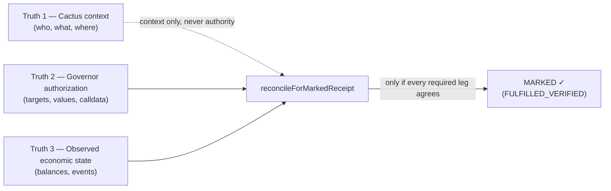
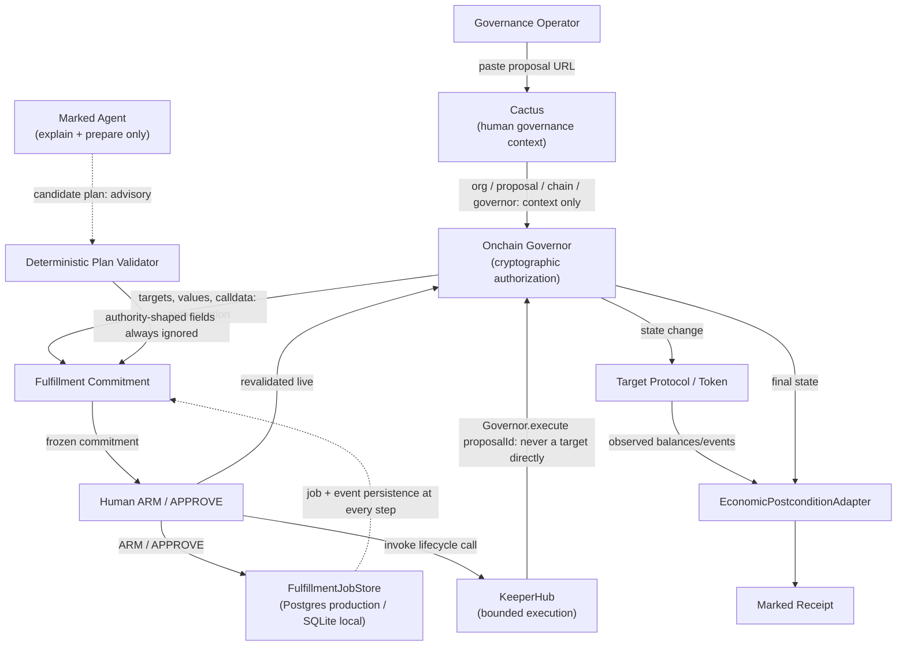
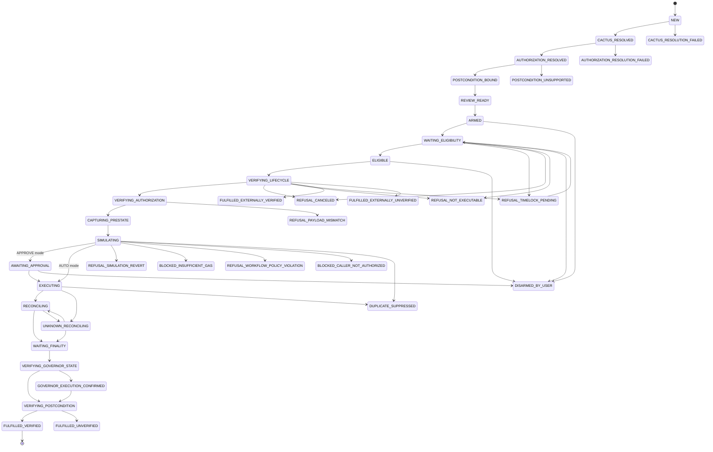

# Marked — Architecture

This document goes deeper than README.md's system map. It describes how Marked is actually built, as of the current codebase — not as the PRD originally proposed it. Where this document and `PRD.md` disagree, this document (and the source it describes) wins; disagreements are recorded in `DECISIONS.md`, never silently resolved.

Audience: engineers extending Marked, security reviewers, and anyone who needs to know *why* a boundary is where it is, not just that it exists.

---

## 1. System overview

Marked answers one question a passed DAO proposal does not answer on its own: **did the thing the DAO voted for actually happen, economically, and can that be proven?**

A proposal passing a vote is a political fact. Marked's job starts after that: resolve what was actually authorized on-chain, wait until it is legal to act, invoke the one correct execution path, and independently verify the resulting economic state — only then emit a receipt.

Marked is not a governance platform, not a voting system, and not a general-purpose transaction bot. It is a narrow, deterministic fulfillment layer that sits between a passed governance decision and a proven economic outcome.

## 2. Design goals

- **Every authority-bearing decision must be independently re-derivable from primary sources** (the Governor contract, the target protocol's own state), never inherited from a UI, an indexer, or a model.
- **Every refusal is a first-class product result**, not a silent failure or a generic error page — the state machine names it.
- **No step may be skipped by construction**, not merely by convention — illegal transitions must be structurally unrepresentable, not just discouraged.
- **A claim is never made until it is proven** — "implemented" and "proven against a real system" are different words in this codebase's own vocabulary, and evidence lives in `evidence/` as committed, reproducible artifacts.

## 3. Non-goals

- Marked does not decide *what* a DAO should do. It has no opinion on proposal content.
- Marked does not vote, propose, queue, or cancel governance actions.
- Marked is not a general-purpose transaction relay — it only ever invokes one thing: the Governor's own lifecycle entrypoint for a proposal it has already authorized.
- Marked does not claim distributed, multi-node, or high-availability infrastructure. Its persistence and concurrency guarantees are described exactly as what is implemented and proven, not aspirationally.
- Marked is not, today, a closed-loop "click a live Cactus proposal and watch KeeperHub execute it" product — see §31 (Mode C).

## 4. Authority model

Four actors, four distinct authority levels, deliberately never conflated:

| Actor | May do | May never do |
|---|---|---|
| **Cactus** | Identify the human governance object — organization, proposal, chain, Governor address | Supply calldata, an authorization hash, or any money-moving value |
| **The Governor (on-chain)** | Be the sole source of execution authorization — targets, values, signatures, calldata, proposal identity | — (this is the authority) |
| **The Marked Agent (LLM)** | Explain, narrate, compose a *candidate* plan from data already independently resolved | Author `recipient`/`amount`/`target`/`calldata`/`governor`/`proposalId`/`chainId`/any authorization hash/execution function/approval/verified-state as an authoritative value — see §14 |
| **KeeperHub** | Fulfill an already-frozen, already-approved authorization by invoking the Governor's own lifecycle entrypoint | Reinterpret governance intent, or call a target contract directly |

See `packages/core/src/auth.ts` for a fifth, much narrower actor — the demo session boundary that gates who may click ARM/APPROVE/DISARM in the deployed app. That is a UX/audit-trail boundary, not part of this authority model — it decides *whether a request may act at all*, never *what the action means*. See `docs/SECURITY.md` §Authentication for its current, honestly-stated strength.

## 5. The three-truth model

Marked's central reconciliation idea, restated precisely:

**Truth 1 — human/political context (Cactus).** Which DAO, which proposal, what humans were discussing. Never money-moving.

**Truth 2 — cryptographic authorization (the Governor).** Targets, values, signatures, calldata, proposal identity, read directly from the Governor contract. This is execution authority.

**Truth 3 — economic reality (the target protocol).** What actually changed on-chain, independently observed via block-pinned balance reads and a transaction-bound event log — never inferred from a receipt's `status: 1` alone.



`reconcileForMarkedReceipt`'s own input type structurally excludes every single-signal shortcut — a KeeperHub "completed" status, a receipt's `status: 1`, `Governor.state() == Executed` alone, or a Transfer event's mere existence can none of them, alone, produce `FULFILLED_VERIFIED`. See `packages/core/src/receipt.ts` and its exhaustive mutation-sensitivity test suite.

## 6. Component architecture



Notice what does **not** appear: an arrow from Cactus or the Agent directly to KeeperHub. Neither can construct or authorize an execution — every path to KeeperHub passes through the Governor-derived, frozen `FulfillmentCommitment` and a human ARM/APPROVE.

## 7. Package boundaries

| Package | Purpose | Authority | Must never |
|---|---|---|---|
| `packages/core` | State machine, fulfillment job/event types, auth, receipt computation, agent-plan validation, fulfillability, recovery classification. Pure logic, no I/O. | Owns the state-machine transition table and the receipt-reconciliation invariant | Perform network I/O; accept a status transition not in its own transition table |
| `packages/cactus` | Resolve governance-native context from a Cactus/Tally proposal URL | None over execution calldata | Supply `actionAuthorizationHash` or any money-moving action data |
| `packages/governor` | Read a Governor contract's canonical authorized actions and lifecycle state | The execution authorization source | Accept a cached/indexed value in place of a live contract read for an authorization decision |
| `packages/keeperhub` | Simulate and execute a Governor lifecycle call via KeeperHub's REST API | Fulfill an already-authorized call | Reinterpret governance intent; call a target contract directly; conflate simulate and execute into one ambiguous call |
| `packages/postconditions` | Verify a target protocol's resulting economic state (`ERC20TransferAdapter`) | Independent economic observer | Approximate an unsupported semantic as verified; read Cactus-rendered prose |
| `packages/db` | `FulfillmentJobStore` abstraction + SQLite/Postgres/in-memory implementations, migrations | Persistence only — never a decision-maker | Silently fall back between backends on misconfiguration; run destructive test operations without explicit opt-in (see `docs/TESTING.md`) |
| `packages/config` | A strict, fail-closed env schema | None — not wired into any runtime path (see `docs/OPERATIONS.md`) | — |
| `apps/web` | The deployed product | Orchestrates the above; owns the auth/session boundary | Construct a blockchain write anywhere in its own code (it doesn't — see §15) |
| `apps/cli` | `marked verify <receipt_id>` and other operator commands | Read-only verification tooling | — |
| `scripts/` | One-time, offline proof/verification scripts | The only place a real blockchain write is possible in this repository | Be reachable from `apps/web`'s request-handling code (confirmed not reachable — see §32) |
| `evidence/` | Committed, reproducible proof artifacts | The record of what has actually been demonstrated | Contain a real secret (verified before every commit) |

## 8. Cactus resolution

```
Cactus proposal URL
        ↓  https-only, exact-hostname allowlist (packages/cactus/src/url.ts)
Official GraphQL API (if CACTUS_API_KEY configured)
        ↓  falls through on auth failure, not on any other error
Real public Cactus/Tally proposal-page resolution (SSR fallback)
        ↓  a genuine HTTP request to live Cactus infrastructure, never a mock
organization / proposal / chain / Governor coordinates
        ↓
independent Governor read (packages/governor)
```

The SSR fallback path parses the same `__NEXT_DATA__` structure the real Cactus/Tally frontend renders — it is not simulated Cactus, and it is not the officially-authenticated path either; it is the actual default in an environment without `CACTUS_API_KEY` (which is most environments, since no zero-auth authenticated read path exists — see DEC-011). Any resolution failure produces a typed `CactusResolutionError`; there is no fallback to trusting raw user-supplied coordinates. See `docs/SECURITY.md` §SSRF for the host-allowlist detail.

## 9. Governor authorization

Marked supports Governor Bravo only. A canonical authorization consists of:

```
chainId, governor address, governorFamily, proposalId,
ordered actions: [{ target, value, signature, calldata }, ...]
```

Deliberately excluded from the authorization hash: ETA, queued state, current lifecycle state, execution timestamp — these are *temporal* facts about a proposal, not part of what was authorized. A proposal's lifecycle transitioning (Queued → Executable → Executed) must never change its `actionAuthorizationHash` (BUILD_CONTRACT law 41, proven per-Governor-family in `packages/governor/src/resolve.test.ts`).

The canonical Gate 2 hash: `0x29fab99c1fd3e796981fb2ae34b92280c7405bfafe6ef60882628ddec1dab28d`.

**Frozen vs. current authorization**: a `FulfillmentCommitment` freezes `frozenActionAuthorizationHash` at resolution time. Before ARM, Marked re-reads the Governor live and compares — a mismatch refuses (`ArmRefusedError("AUTHORIZATION_CHANGED")`), never silently re-arms against the new value. The frozen hash is what the human reviewed; the live hash is what is true right now; ARM requires them to be equal.

## 10. Canonical hashing

Two structurally distinct hash domains, never interchangeable (BUILD_CONTRACT law 48):

- **`actionAuthorizationHash`** — identity of *what a proposal authorizes* (Gate 2, `packages/governor`).
- **`fulfillmentCommitmentHash`** — identity of *the exact reviewed commitment* (chain, Governor, proposal, frozen authorization hash, selected actions, postcondition bindings, mode, execution surface, policy version) — `packages/core/src/fulfillment-commitment.ts`.
- **`executionCallHash`** — identity of one Governor lifecycle call plan (Gate 5, `packages/keeperhub`), bound to `actionAuthorizationHash` by comparison, never assumed equal.
- **`receiptHash`** — identity of the final reconciled receipt (Gate 6, `packages/core/src/receipt.ts`) — see §24.

Each is domain-separated (a distinct string constant prefixes its encoding) so a hash from one domain can never collide with, or be mistaken for, a hash from another.

## 11. Fulfillment commitment

```
Governor authorization
       ↓
postcondition binding (which actions, which adapter, required or not)
       ↓
execution policy (which surface, which policy version)
       ↓
Fulfillment Commitment  (chain + governor + proposal + frozen auth hash +
                          selected actions + postcondition bindings +
                          mode + execution surface + policy version)
       ↓
human approval  (bound to this exact commitment's hash — never
                 "approve whatever is current")
```

Why it exists: the object a human reviewed and armed must be the exact same object later considered for execution — never a re-derived approximation of it. `approveFulfillmentJob` checks `fulfillmentCommitmentHash` equality explicitly (`ApprovalHashMismatchError` on any drift) rather than re-trusting "the job that has this id right now."

## 12. State machine

Full status set and transition table: `packages/core/src/status.ts` / `fulfillment-state-machine.ts` — this is the authoritative source; read it directly rather than trusting any summary, including this one, if they ever disagree.



Every terminal status (everything with no outgoing edge above, except the documented `REFUSAL_TIMELOCK_PENDING` "waiting, not dead" exception) is programmatically proven to have zero legal outgoing transitions — not merely undocumented ones. A dedicated test (`fulfillment-state-machine.test.ts`, added Gate 12) walks the entire transition table breadth-first from `NEW` and confirms every declared status is reachable — no orphan states.

**`MARKED ✓` is the display label for `status === "FULFILLED_VERIFIED"`, computed by exactly one function, `isMarked()`.** No UI surface may invent its own partial-status-list check for this — BUILD_CONTRACT law 59.

## 13. Human authorization

ARM, APPROVE, and DISARM are the only human-facing mutations. Each:
1. Authenticates first (see `docs/SECURITY.md` §Authentication for exactly what this currently guarantees).
2. Re-derives its decision from a just-read job snapshot (never a cached/client-supplied one).
3. Calls the corresponding pure domain function in `packages/core` (`armFulfillmentJob`/`disarmFulfillmentJob`/`approveFulfillmentJob`), which itself calls `transition()` — the sole function permitted to produce a new status.
4. Persists via `store.saveWithCas(nextJob, [event], job.status)` — a compare-and-set against the exact status the decision was computed from (fixed Gate 12 — see §20 and `docs/SECURITY.md`).

## 14. Agent boundary

```
Input to the model:  ResolvedGovernanceContext + CanonicalGovernorAuthorization
                      + DeterministicPostconditionSupport + FulfillabilityAssessment
                      (all already independently resolved, before the model is ever called)
                              ↓
LLM produces:         CandidateAgentPlan
                      { version, explanation, proposalSummary,
                        suggestedActionIndexes, executionExplanation,
                        verificationExplanation, riskNotes, operatorQuestions? }
                      — a .strict() Zod schema with NO field for recipient,
                        amount, target, calldata, governor, proposalId,
                        chainId, any authorization hash, execution function,
                        approval, or verified state
                              ↓
Deterministic validator (packages/core/src/agent-plan.ts):
                      validateAgentPlan() → ValidatedAgentPlan
                                          | AGENT_PLAN_REJECTED
                                            (SCHEMA_INVALID |
                                             NO_ACTIONS_SUGGESTED |
                                             DUPLICATE_ACTION_INDEX |
                                             ACTION_INDEX_NOT_FOUND |
                                             ACTION_UNSUPPORTED |
                                             REQUIRED_ACTION_OMITTED |
                                             FULFILLABILITY_NOT_READY)
```

The model cannot author an authority-bearing field *at all* — not because a runtime filter strips one, but because the schema has no such field, `.strict()`, so an extra field is a parse failure, not a silently-dropped one. **The model is advisory. The validator is authoritative.** See `docs/SECURITY.md` §LLM threat model for the adversarial-input list this boundary is proven against.

A real, live OpenRouter model was exercised through this exact boundary during development (`evidence/agent-hardening/live-model/`) — that is a recorded proof, not the default behavior of a fresh clone, which ships with no model-provider key and shows an honest "Agent unavailable" state until an operator configures one.

## 15. KeeperHub execution

`packages/keeperhub/src/client.ts` exports exactly two functions, structurally separate — never one function with an ambiguous simulate-or-execute flag:

- `simulateContractCall(...)` — read-only, no broadcast, no reservation.
- `executeContractCall(...)` — the one function in this entire repository capable of a real KeeperHub-mediated Governor execution. Sends an `Idempotency-Key` header derived deterministically from the call itself (`hashContractCall(call)`), so identical retries carry the same key.

**KeeperHub always calls the Governor's own lifecycle entrypoint** (e.g. Bravo's `execute(proposalId)`) — **never a target contract directly**, regardless of how confident Marked is about what that call would do (BUILD_CONTRACT law 47).

Repo-wide grep confirms `executeContractCall` is imported only by its own definition/tests, the package's barrel export, and two offline proof scripts (`scripts/gate5-keeperhub-execute.ts`, `scripts/prove-keeperhub-seam.ts`) — **`apps/web/src` imports it nowhere.** The deployed app's ARM→APPROVE flow computes and persists an internal `EXECUTING` status but does not currently dispatch to KeeperHub — see §32.

## 16. Caller authority

Caller authority for a Governor lifecycle entrypoint is never assumed permissionless merely because a reference implementation is permissionless (BUILD_CONTRACT law 50). A live, per-deployment simulation is required before execution; an unauthorized caller produces `BLOCKED_CALLER_NOT_AUTHORIZED`, a named terminal status, never a silent skip.

## 17. Simulation

`simulateContractCall` must be called, and must not revert, before `executeContractCall` is ever reachable in the state machine (`SIMULATING` precedes `EXECUTING`/`AWAITING_APPROVAL`). A failed simulation cannot be overridden by an LLM (BUILD_CONTRACT law 22) — the agent has no path to this call at all (§14).

## 18. Idempotency

Identity chain: `jobId` (deterministic — `jobIdForCoordinate(chainId, governor, proposalId)`, so re-resolving the same proposal always finds the same job) → `fulfillmentCommitmentHash` (hash-pinned, re-verified at every ARM) → execution claim (`request_hash` as a real storage-level `PRIMARY KEY`, Gate 7) → KeeperHub `Idempotency-Key` (deterministic from the call) → tx hash → Governor proposal state → `receiptHash`.

**No exactly-once execution claim is made.** What is proven: the execution-claim layer has a real, storage-level compare-and-set (proven by genuine concurrent-race tests), and — since Gate 12 — the pre-execution ARM/APPROVE/DISARM layer does too. What is honestly not yet proven: the live app does not currently exercise the execution-claim layer at all, because it does not currently trigger a real execution (§15).

## 19. Persistence

```
FulfillmentJobStore  (packages/db/src/fulfillment-job-store.ts — the interface;
                       business logic depends on this, never a concrete class)
      ├── SqliteFulfillmentJobStore     local development/testing (default)
      ├── PostgresFulfillmentJobStore   production-compatible, Vercel-safe
      └── InMemoryFulfillmentJobStore   fastest unit-test double
```

Driver selection is explicit (`MARKED_STORAGE_DRIVER`), never inferred from `NODE_ENV`, and fails closed (`PersistenceConfigurationError`) rather than silently falling back to SQLite when `postgres` is selected without `DATABASE_URL`, or when the value is an unrecognized string. A malformed `DATABASE_URL` (not merely an unreachable one) also fails closed as a typed error, not a raw driver exception (fixed Gate 12).

**Both backends are proven, not merely implemented**, against a real database engine: `node:sqlite` for SQLite, and a real hosted Neon Postgres database for `PostgresFulfillmentJobStore` (Gate 11) — atomic job+event writes, compare-and-set, transaction rollback (via a genuine forced mid-transaction failure), restart/reconnect survival, and JSONB serialization round-trip were all exercised for real, not only reasoned about. See `evidence/production-persistence/hosted-production-proof.md`.

## 20. Concurrency

Every state-changing operation is now guarded against a TOCTOU race (read → decide → write, without an atomic guard at the write):

- **Execution claim** (`tryClaimExecution`) — a real `PRIMARY KEY` constraint, proven with genuine two-worker races since Gate 7/11.
- **ARM/APPROVE/DISARM** — `saveWithCas(nextJob, [event], job.status)`, a compare-and-set on the exact status the decision was computed from (fixed Gate 12 — previously an unconditional upsert, which let two racing mutations both silently "succeed," duplicating an audit event or overwriting one caller's outcome without telling either caller a race occurred). See `docs/SECURITY.md` and `evidence/system-audit/concurrency-audit.md`.

## 21. Unknown-outcome recovery

```
EXECUTION REQUEST
      |
      +-- known failed before broadcast → safe refusal, no execution claim held
      |
      +-- known tx hash → reconcile that tx directly
      |
      +-- unknown outcome → UNKNOWN_RECONCILING
                              |
                              +→ inspect KeeperHub execution identity
                              +→ inspect live Governor state
                              +→ inspect chain state directly
                              |
                              +→ NEVER a fresh, blind resend with a new identity
```

The recovery classifier's return type structurally excludes resubmission as an outcome (`mayResubmit` is typed as the literal `false`, not `boolean` — BUILD_CONTRACT law 56) — a future code change cannot accidentally permit it by flipping a runtime flag. `UNKNOWN_RECONCILING` is a first-class named status, reachable from both `EXECUTING` and `RECONCILING`, with legal forward paths only toward reconciliation, never backward toward a fresh attempt.

**Honestly not yet live-exercised**: this gate could not exercise this path against real KeeperHub infrastructure (zero-write constraint), and no application code currently drives a job through this loop at all, consistent with §15/§32 — the live app never starts a real execution to reconcile.

## 22. Finality

Gate 5/6's Sepolia proofs use a stated 2-confirmation threshold, explicitly labeled as a deliberate policy for that controlled proof — never generalized into a universal or mainnet finality claim. `MARKED ✓` is reachable only through `VERIFYING_POSTCONDITION`, which itself reads block-pinned state.

## 23. Postcondition verification

`EconomicPostconditionAdapter` bundle, currently one implementation: `ERC20TransferAdapter`. Expected token/recipient/amount are decoded only from the Governor's authoritative action bytes — never from Cactus-rendered prose (BUILD_CONTRACT law 43). Verification requires a block-pinned pre-balance, a block-pinned post-balance, an exact delta, and a transaction-bound `Transfer` log — all four, not any one alone. Unsupported semantics (fee-on-transfer, rebasing, `transferFrom`, an unrecognized signature, ambiguous corroborating logs) fail closed to `verified: false`, never approximated to a pass. Coverage is `FULL`/`PARTIAL`/`UNSUPPORTED`; `MARKED ✓` requires every required material action at `FULL`.

## 24. Receipt generation

```ts
type MarkedReceipt = {
  version: 1;
  fulfillmentCommitmentHash: Hex;
  frozenActionAuthorizationHash: Hex;
  finalGovernorAuthorizationHash: Hex;
  chainId: ChainId; governor: HexAddress; governorFamily: GovernorFamily; proposalId: string;
  actionIndex: number;
  executionTxHash: Hex; executionBlock: string; finalityBlock: string;
  governorFinalState: number;
  postconditionCoverage: PostconditionCoverage; requiredAssertionsVerified: boolean;
  status: "FULFILLED_VERIFIED" | "FULFILLED_UNVERIFIED";
  observedAt: string;
};
```

`receiptHash` is a domain-separated (`MARKED_RECEIPT_V1`) hash over this structure — **it is not a blockchain transaction hash**; `executionTxHash` is the separate field for that. A dedicated, pre-existing mutation-sensitivity test suite (`packages/core/src/receipt.test.ts`) proves the hash changes under a mutation to any load-bearing field, and is unaffected by `observedAt`/JS key order. See README's Canonical Proof section for the real, committed Gate 6 values.

## 25. Authentication boundary

See `docs/SECURITY.md` §Authentication for the complete, honestly-stated current implementation and its known limitation (Gate 12 finding F-03). Summary: mutation routes (ARM/APPROVE/DISARM) always authenticate before touching the store; the header-based path (`x-demo-token`) genuinely requires knowing the real secret (hardened to constant-time comparison, Gate 12); the cookie/UI login path does not require the visitor to know the secret at all, by deliberate design (a judge should never need the real token) — this is disclosed, not hidden, and does not reach any real blockchain effect (§15/§32).

## 26. SSRF / network boundary

The only user-controlled URL in the application (`/app/new`'s Cactus proposal URL) passes through a strict `https:`-only, exact-hostname allowlist (`packages/cactus/src/url.ts`) before any outbound fetch — see `docs/SECURITY.md` §SSRF for the full attack-input table and the one known, documented gap (redirect-destination re-validation).

## 27. Secret handling

Server-only env vars are never logged, never embedded in an error message surfaced to a user, and never passed as a prop into a `"use client"` component (traced for every candidate — see `evidence/system-audit/secrets-dependency-env-audit.md`). The demo session token never reaches the browser in any form — the session cookie carries only an opaque `"1"` marker.

## 28. Deployment architecture

`apps/web` deploys to Vercel. `MARKED_STORAGE_DRIVER=sqlite` (the default) does not survive Vercel's ephemeral, per-instance filesystem — `postgres` is required for any real deployment. Every DB-backed/auth-sensitive route is `force-dynamic`, so no caching layer sits between a request and live state for anything execution-relevant. `pnpm build` does not open a database connection (a real Gate 11 bug of exactly this kind was found and fixed, and re-verified clean in Gate 12). See `docs/OPERATIONS.md` and `VERCEL_ENVIRONMENT.md`.

## 29. Failure taxonomy

- **Named refusal states** (state machine) — `REFUSAL_*`, `BLOCKED_*`: a deterministic, structural "no," not an exception.
- **Typed persistence errors** (`packages/db/src/errors.ts`) — `PersistenceUnavailableError`/`PersistenceConflictError`/`PersistenceTransactionFailedError`/`PersistenceConfigurationError`, never a raw driver stack trace surfaced to a caller (Gate 12 closed the one gap where this wasn't yet true — a malformed `DATABASE_URL`).
- **Typed auth errors** — `UnauthenticatedError`, fails closed before any mutation.
- **Typed Cactus/agent errors** — `CactusResolutionError`, `AgentProviderError` — never a silent fallback to an unvalidated value.
- **Unreconciled execution** — `UNKNOWN_RECONCILING`, never a fresh resend (§21).

## 30. Supported / unsupported semantics

Explicitly supported: Governor Bravo; direct KeeperHub `execute-contract-call` (Option B); `ERC20TransferAdapter`'s exact-delta-plus-log verification. Explicitly unsupported, and refused rather than approximated: any other Governor family; KeeperHub Workflow execution (Option A); fee-on-transfer/rebasing/`transferFrom` tokens; private/MEV-protected routing.

## 31. Mode C proof topology

Two labeled lanes, one shared engine, never narrated as one closed loop (DEC-015):

- **Lane 1** — real Cactus mainnet governance objects, resolved and read-only (Gate 1A).
- **Lane 2** — a controlled Sepolia Governor, a real KeeperHub write, and real independent economic verification (Gates 5/6).

The Lane 2 object is not Cactus-indexed (new DAO submissions to Cactus were observed paused during this project's build); no live Cactus proposal has been executed through KeeperHub end-to-end. See README's Mode C section for the full, current limitations list.

## 32. Extension points

- A new `Governor` family: implement the same adapter shape `packages/governor` already proves for Bravo, including the "live capability probe, never a guessed family" discipline (BUILD_CONTRACT law 42).
- A new postcondition adapter: implement `EconomicPostconditionAdapter`'s interface, deriving expectations only from authoritative action bytes (never proposal prose), and fail closed on any unsupported semantic rather than approximating.
- Wiring real KeeperHub execution into the live web app: the execution-claim CAS (§18/§20) and the state machine's `EXECUTING`/`RECONCILING` shape already exist for this — the missing piece is application code in `apps/web` that actually calls `executeContractCall` and drives the reconciliation loop (§21). This is the most consequential extension point in the codebase — wiring it in makes several currently-low-impact findings (see `docs/SECURITY.md`) immediately higher-stakes, and should not be done without re-reading that document first.

## 33. Security invariants

The complete, authoritative list is BUILD_CONTRACT.md's 68 gate-derived invariants plus its "24 laws" and PRD-derived system invariants — this document does not restate them. The ones most load-bearing to this architecture: laws 1-6 (authority separation), 9/36/52/56 (no blind resubmission), 10-13/44-46 (postcondition verification is mandatory), 47-54 (KeeperHub/execution safety), 57-58 (real CAS, real restart survival, always-authenticated mutation), 63-66 (agent boundary), 68 (persistence driver discipline).

## 34. Reproduction / evidence map

Every architectural claim in this document maps to a committed, reproducible artifact under `evidence/`. See README's Evidence / Reproducibility table for the canonical claim → evidence → reproduce-command mapping; this document does not duplicate it.
